# Application de gestion des livres

## Captures d'écran

### Inscription / login

- Inscription

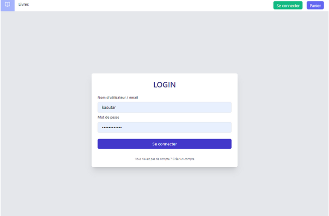
 
  L'utilisateur doit pouvoir s'inscrire en renseignant son nom, prénom, nom d'utilisateur, email et mot de passe.

- Login

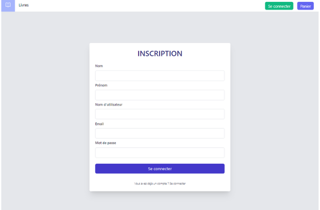

  L'utilisateur doit pouvoir se connecter en renseignant son nom d'utilisateur ou email et son mot de passe.

### Interface Admin

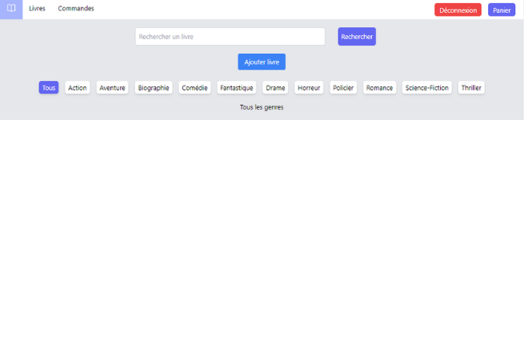

L'administrateur se connecte.
Il peut voir la liste des livres, faire des recherches par genres ou mots clés.
Il peut ajouter des livres, les modifier et les supprimer.
Il peut aussi voir la liste des commandes, les vérifier ou les annuler.

- Ajouter un livre

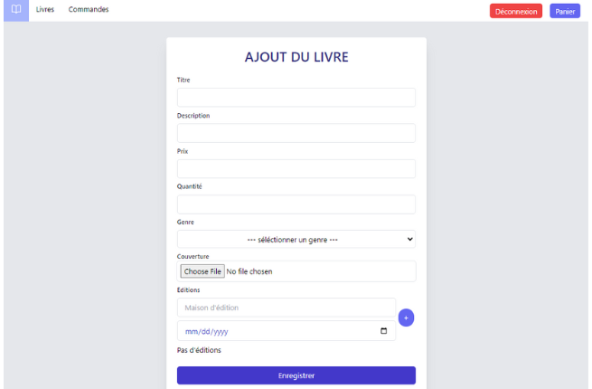

  L'administrateur ajoute le titre, la description, le prix, la quantité en stock, le genre ( à partire d'une liste ) et la couverture du livre.
  Il peut aussi ajouter une ou plusieurs éditions du livre en cliquant sur le bouton "+".

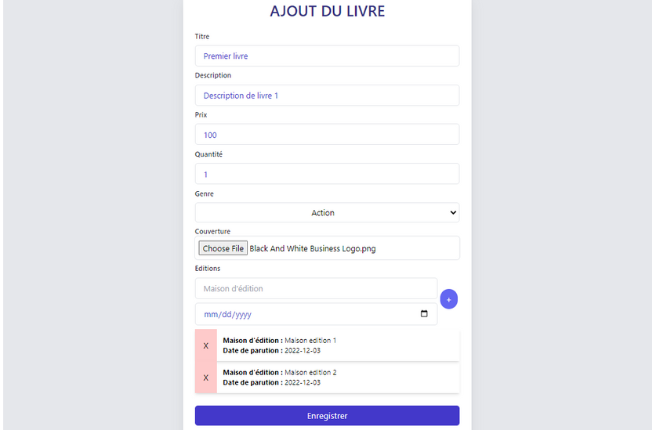

- Liste des livres

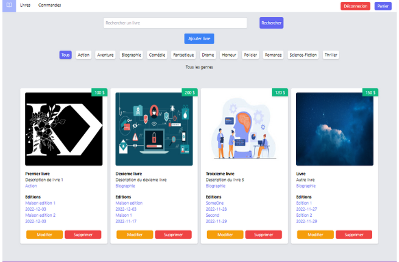

  L'administrateur peut voir la liste des livres.
  Il peut aussi faire des recherches par genres :

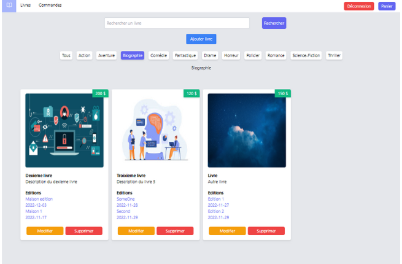
  
  Ou mots clés :

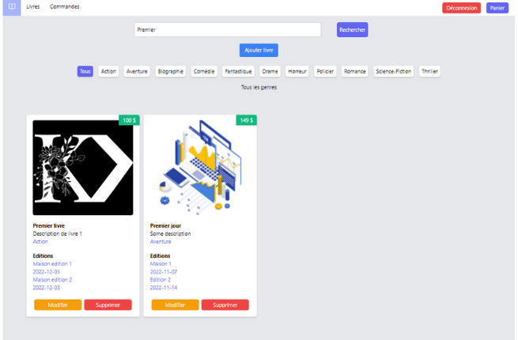
- Modifier un livre

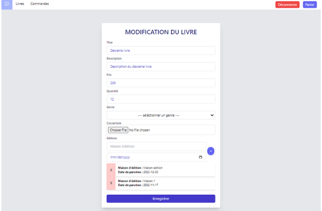

  L'administrateur peut modifier les informations du livre.
  Il peut ajouter ou supprimer les éditions en cliquant sur "+" ou "x" respectivement.

- Liste des commandes

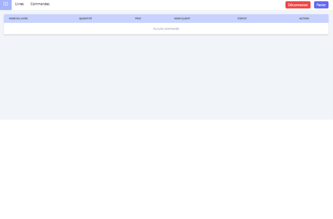

  L'administrateur peut voir les commande faites par l'utilisateurs, les vérifier, les voir ou les annuler.

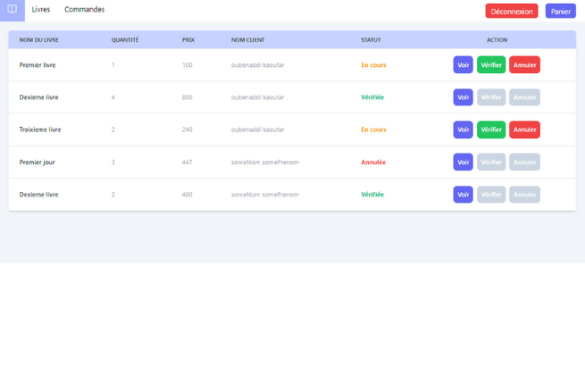

- Consultation d'une commande

  En cliquant sur voir, l'administrateur peut voir les détails de la commande.
  Il peut voir les informations de la commande, les livres commandés et les informations de l'utilisateur.

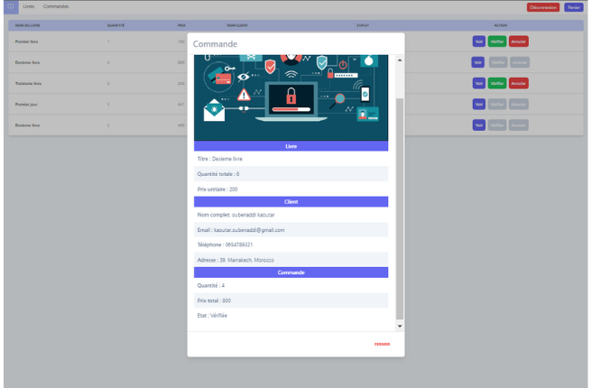
  
### Interface Utilisateur
 
- Liste des livres

  L'utilisateur, sans besoin d'être connecté, peut voir la liste des livres ajoutés par l'administrateur, il peut aussi effectuer des recherches selon les critères du genre ou mots clès.
  L'utilisateur a le droit de lancer des commandes en ajoutant un ou plusieurs livres au panier, il peut par la suite choisir la quantité voulue ou la modifier, voir le prix total et supprimer les livres du panier.
  Après, pour valider la commande et l'envoyer à l'admin pour la vérifier, l'utilisateur remplis un formulaire donné.

- Panier

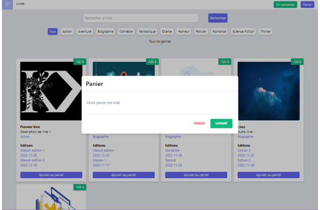

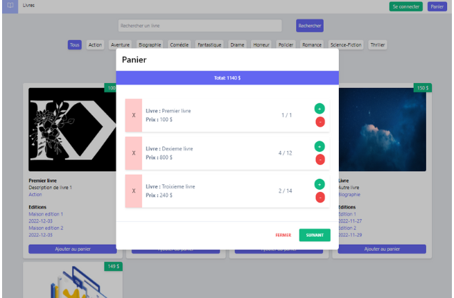

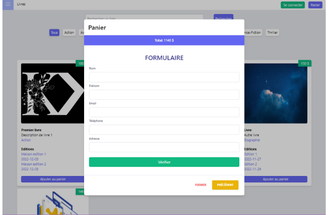

